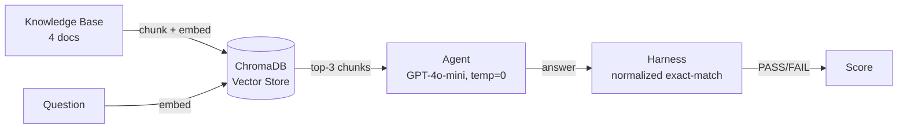

<div align="center">

# Gatekeeper

**A self-improving RAG agent with a regression-proof learning gate.**

Improvement gets in. Regression doesn't.


</div>

---

## Overview

Gatekeeper is a retrieval-augmented Q&A agent built on a knowledge base of solar system facts. It retrieves relevant context before answering, and every answer is scored by a deterministic evaluation harness using normalized exact-match — not a human, not an LLM judge.

The current milestone establishes the foundation: a trustworthy retrieval pipeline and a reproducible pass/fail signal. This is the layer everything else gets built on.

## Architecture



## Features

- **Semantic retrieval** — documents chunked and embedded with `text-embedding-3-small`, queried via ChromaDB top-k similarity search
- **Context-grounded answering** — the agent is instructed to answer only from retrieved context, at temperature 0 for deterministic output
- **Deterministic evaluation** — normalized exact-match scoring (case, whitespace, and trailing punctuation insensitive)
- **Train / held-out separation** — physically separate datasets to keep evaluation honest
- **Reflection primitive** — a `reflect()` function that drafts a general lesson from any failure, ready to be wired into a learning loop

## Tech stack

| Layer | Technology |
|---|---|
| LLM | OpenAI `gpt-4o-mini` |
| Embeddings | OpenAI `text-embedding-3-small` |
| Vector store | ChromaDB (persistent, local) |
| Language | Python 3.13 |

## Installation

```bash
git clone https://github.com/ayeshowcode/Gatekeeper.git
cd Gatekeeper/regression-rag
python -m venv .venv
.venv\Scripts\activate          # Windows
pip install -r requirements.txt
```

Set your OpenAI API key:

```bash
export OPENAI_API_KEY=sk-...    # macOS/Linux
$env:OPENAI_API_KEY="sk-..."    # Windows PowerShell
```

## Usage

```bash
# Build the vector index (one-time)
python src/retriever.py

# Evaluate on the training set
python src/harness.py --dataset data/train.json

# Evaluate on the held-out set
python src/harness.py --dataset data/heldout.json
```

Sample output:

```
  [PASS] t01: What is the diameter of Mercury?
  [FAIL] t05: How many moons does Mars have?
         expected: '2'
         got:      'two'
  ...

train: 17/20
```

## Results

| Dataset | Score | Accuracy |
|---|---|---|
| `train.json` | 17 / 20 | 85% |
| `heldout.json` | 9 / 10 | 90% |

All current failures are answer-format mismatches (e.g. `"two"` vs `"2"`, missing units) rather than factual errors — the retrieval and reasoning pipeline is sound.

## Project structure

```
regression-rag/
├── data/
│   ├── docs/              # knowledge base (4 documents, 2 planets each)
│   ├── train.json         # 20 train Q→A pairs
│   ├── heldout.json       # 10 sealed Q→A pairs
│   └── chroma/            # persisted vector index (generated)
├── src/
│   ├── retriever.py       # chunking, embedding, top-k retrieval
│   ├── agent.py           # answer() and reflect()
│   └── harness.py         # normalized exact-match evaluation
└── requirements.txt
```

## Design notes

- **Planetary facts as the domain** — specific enough (exact moon counts, temperatures, dates) that the model can't shortcut from memory; it must rely on retrieval.
- **Two planets per document** — keeps retrieval non-trivial; a single-planet-per-file layout would make lookup too easy to ever fail.
- **Train/held-out as separate files** — prevents accidental leakage between data used for learning and data used for evaluation.
- **Shared skills across train/held-out** — both sets test the same categories (moon counts, temperatures, spacecraft dates, orbital periods, diameters) on different planets.
- **Loose normalization** — only formatting noise is removed; semantic near-misses are left as real failures.

## License

MIT
