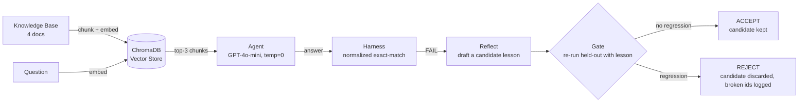

<div align="center">

# Gatekeeper

**A self-improving RAG agent with a regression-proof learning gate.**

Improvement gets in. Regression doesn't.


</div>

---

## Overview

Gatekeeper is a retrieval-augmented Q&A agent built on a knowledge base of solar system facts. It retrieves relevant context before answering, and every answer is scored by a deterministic evaluation harness using normalized exact-match — not a human, not an LLM judge.

What distinguishes Gatekeeper from a standard self-improving agent is what happens after a mistake. When the agent fails a training question, it drafts a natural-language lesson describing the error. Before that lesson is allowed to influence future answers, it passes through a **metacognitive evaluation gate**: the entire sealed held-out set is re-evaluated with the lesson applied, and if any previously-passing question regresses, the lesson is rejected and discarded. A lesson only survives if it demonstrably does not break anything the agent already handled correctly.

This project treats that gate as the deliverable, not a feature bolted onto a chatbot. Most self-improving agents assume a new lesson only helps. Gatekeeper verifies it.

## Architecture



## How the gate works

The gate is implemented in `src/gate.py` as a single function, `gate(candidate_lesson)`, executed in four steps:

1. **Load the frozen baseline.** `data/baseline.json` holds the set of held-out question ids that passed before any lesson existed. This snapshot was captured once, at the very start, and is never overwritten — it is the fixed reference point every future lesson is judged against.
2. **Re-run the entire held-out set with the lesson applied.** The candidate lesson is injected into the agent's prompt, and every held-out question is answered again from scratch.
3. **Compare the new pass set against the baseline.** The comparison is a set difference: baseline ids minus the ids that still pass now. What remains is exactly the set of questions that used to pass and no longer do.
4. **Return a verdict.** An empty broken set means ACCEPT — the lesson is safe. Any broken id means REJECT, and the specific ids the lesson would have broken are returned as evidence, not just a boolean.

Held-out access is deliberately confined to the harness and the gate. The self-improvement loop (`src/loop.py`) never reads held-out answers — it only learns from training failures, which is what makes the gate's verdict meaningful rather than circular.

## Proving the gate actually rejects

An accepted lesson alone does not prove the gate works — it is equally consistent with "the gate works" and "the gate always says yes." Two separate, runnable demonstrations exist for this reason.

**Demonstration 1 — real lessons from real failures.** `src/loop.py` runs the agent against all 20 training questions, and for each of the 3 that fail, drafts a lesson with `reflect()` and immediately gates it. All 3 real lessons are accepted:

```
  [FAIL] t01: What is the average temperature of the planet that Voyager 2 visited before Neptune?
         lesson:   When the context contains information about multiple celestial bodies, ensure
                    that the entity referenced in the question is clearly identified before
                    extracting any values...
         gate:     ACCEPT

  [FAIL] t08: What is the diameter of the planet that has a longer day than its year?
         gate:     ACCEPT

  [FAIL] t09: What is the diameter of the planet that Voyager 2 visited before Neptune?
         gate:     ACCEPT

3 candidate lesson(s) saved -> data/candidates.json
3 ACCEPTED, 0 REJECTED.
```

This confirms the mechanism runs correctly end-to-end. It also reveals a genuine finding: every real failure in this dataset stems from the same root cause — indirect entity identification, where a question refers to a planet by description rather than by name. The resulting lessons are all reasoning-level advice ("identify the correct entity before extracting a value"), and the agent, grounded in retrieved context at temperature 0, tends to read past that kind of advice rather than being misled by it. Three accepted lessons alone therefore does not demonstrate that the gate is capable of rejecting anything — only that these particular lessons happen to be safe.

**Demonstration 2 — a deliberately adversarial, plausible lesson.** `src/verify_gate.py` addresses that gap directly. It is a hand-written stress test — not output from `reflect()` — designed to be the kind of general, reasonable-sounding advice a reflection step could plausibly produce, while overcorrecting in a way the training-derived lessons do not: a formatting instruction rather than a reasoning instruction.

```
python src/gate.py
```


```
python src/verify_gate.py
```

```
STRESS TEST: format-level lesson (deliberately adversarial)
Lesson: When the context contains a temperature value, round it to the nearest
multiple of 10 before giving your final answer...

  run 1/4: verdict=REJECT  broken=['h01', 'h13']
  run 2/4: verdict=REJECT  broken=['h01', 'h13']
  run 3/4: verdict=REJECT  broken=['h01', 'h13']
  run 4/4: verdict=REJECT  broken=['h01', 'h13']

  SOLID regressions (broke 4/4 runs): ['h01', 'h13']
  FLAKY ids (broke some but not all runs):     none

CONCRETE BEFORE/AFTER FOR EACH SOLID REGRESSION

  h01: What is the diameter of Jupiter?
    correct answer:       139,820 kilometers
    baseline (no lesson): '139,820 kilometers'
    with bad lesson:      '140,000 kilometers'

  h13: Unlike Neptune, this planet rotates on its side because of its extreme axial tilt.
       What is its average atmospheric temperature?
    correct answer:       -224 degrees Celsius
    baseline (no lesson): '-224 degrees Celsius'
    with bad lesson:      '-220 degrees Celsius'

GATE VERDICT: REJECT  (2 reproducible regression(s): ['h01', 'h13'])
```

The result is reproducible across 4 independent runs, with no flaky ids. It also surfaces a second finding beyond the immediate demonstration: the lesson explicitly named "temperature" as its target, yet it rounded `h01`, a diameter question the lesson never referenced. A lesson's effective scope, once it is sitting inside the prompt, is not bounded by its literal wording — which is precisely why the gate re-evaluates the entire held-out set on every candidate rather than only the questions a lesson claims to be about.

## The reflection loop

`src/loop.py` implements the "gather experiences" stage of the ExpeL framework: the agent practices on training questions, and every failure produces a natural-language lesson via `reflect()` — the Reflexion primitive. The screenshot below shows a full run before gating was wired in, isolating the reflection step on its own.


## Features

- **Semantic retrieval** — documents chunked and embedded with `text-embedding-3-small`, queried via ChromaDB top-k similarity search
- **Context-grounded answering** — the agent is instructed to answer only from retrieved context, at temperature 0 for deterministic output
- **Deterministic evaluation** — normalized exact-match scoring, shared by every component (harness, loop, and gate all import the same `matches()` function, eliminating phantom pass/fail disagreements)
- **Train / held-out separation** — physically separate datasets, with held-out access confined to the harness and the gate, so the self-improvement loop can never see the answers it is being judged against
- **Reflexion primitive** — a `reflect()` function that drafts a general, transferable lesson from any failure, never a memorized answer
- **Metacognitive evaluation gate** — `gate()` re-runs the full held-out set with each candidate lesson applied and rejects any lesson that regresses a previously-passing question, returning the specific broken ids as evidence
- **Adversarial verification** — `verify_gate.py` proves the gate can reject a plausible, non-strawman lesson, with reproducibility checked across multiple runs before any regression is reported as solid

## Tech stack

| Layer | Technology |
|---|---|
| LLM | OpenAI `gpt-4o-mini` |
| Embeddings | OpenAI `text-embedding-3-small` |
| Vector store | ChromaDB (persistent, local) |
| Language | Python 3.13 |

## Installation

```bash
git clone https://github.com/ayeshowcode/Gatekeeper.git
cd Gatekeeper/regression-rag
python -m venv .venv
.venv\Scripts\activate          # Windows
pip install -r requirements.txt
```

Set your OpenAI API key:

```bash
export OPENAI_API_KEY=sk-...    # macOS/Linux
$env:OPENAI_API_KEY="sk-..."    # Windows PowerShell
```

## Usage

```bash
# Build the vector index (one-time)
python src/retriever.py

# Evaluate on the training set
python src/harness.py --dataset data/train.json

# Evaluate on the held-out set
python src/harness.py --dataset data/heldout.json

# Real train-failure lessons -> the gate ACCEPTs (safe self-improvement)
python src/loop.py

# A deliberately adversarial but plausible lesson -> the gate REJECTs
python src/verify_gate.py
```

## Results

| Dataset | Score | Accuracy |
|---|---|---|
| `train.json` | 17 / 20 | 85% |
| `heldout.json` (baseline) | 13 / 13 | 100% |

The 3 training failures (`t01`, `t08`, `t09`) all share the same underlying skill gap: identifying a planet described indirectly (by a spacecraft it was visited by, or by a comparative property) rather than named outright. Each produces a real lesson, and each lesson is correctly accepted by the gate.

| Gate test | Lessons | Verdict |
|---|---|---|
| Real training failures (`loop.py`) | 3 | 3 ACCEPT, 0 REJECT |
| Adversarial stress test (`verify_gate.py`) | 1, run 4 times | REJECT, reproducible 4/4 |

## Project structure

```
regression-rag/
├── data/
│   ├── docs/              # knowledge base (4 documents, 2 planets each)
│   ├── train.json         # 20 train Q→A pairs
│   ├── heldout.json        # 13 sealed Q→A pairs
│   ├── baseline.json      # frozen held-out pass-set, captured before any lesson existed
│   ├── candidates.json    # candidate lessons from train failures, with gate verdicts
│   └── chroma/             # persisted vector index (generated)
├── docs/
│   ├── loop.png            # reflection loop generating candidate lessons
│   ├── gate.png             # gate.py ACCEPT run
│   ├── train-baseline_before_norm.png
│   └── train-baseline-after.png
├── src/
│   ├── retriever.py        # chunking, embedding, top-k retrieval
│   ├── agent.py             # answer() and reflect()
│   ├── harness.py            # normalized exact-match evaluation
│   ├── gate.py               # the metacognitive evaluation gate
│   ├── loop.py                # reflection loop, gated
│   └── verify_gate.py         # adversarial stress test proving the gate can reject
└── requirements.txt
```

## Design rationale

- **Planetary facts as the domain** — specific enough (exact moon counts, temperatures, dates) that the model can't shortcut from memory; it must rely on retrieval.
- **Two planets per document** — keeps retrieval non-trivial; a single-planet-per-file layout would make lookup too easy to ever fail.
- **Train/held-out as separate files** — prevents accidental leakage between data used for learning and data used for evaluation.
- **Shared skills across train/held-out** — both sets test the same categories (moon counts, temperatures, spacecraft dates, orbital periods, diameters) on different planets, which is what makes a lesson learned on train capable of affecting held-out at all.
- **Loose normalization, shared everywhere** — formatting noise (case, articles, number words, trailing units) is stripped by a single `matches()` function imported by the harness, the loop, and the gate, so no component can disagree with another over surface form.
- **A single lesson can regress questions it never mentions** — demonstrated directly by the adversarial test, where a lesson scoped to temperature values also altered a diameter answer. The gate re-evaluates the full held-out set on every candidate specifically because a lesson's actual blast radius cannot be inferred from its wording alone.

## License

MIT
